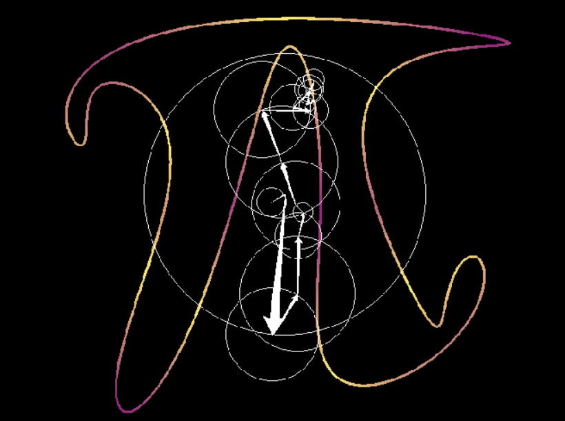

# FTDrawer


This application was created for calculating the Fourier coefficients of the complex function specifying 
the **first** path in the **SVG** file. 

And further displaying the first **n** terms of this series.



# Usage

```
python main.py [filename] [n] [f1]
```

n - number of terms: [-n, ..., 0, ..., n] terms.

f1 - carrier frequency